# Technical Simulation with Canary Tokens

Journalist Security Fellowship

## Learning objectives:

1.  Learn in a safe environment what others can find out about you based on your IP address, and how to mitigate for that

2.  Understand the difference between opening files locally and remotely

3.  Understand the possible risks of opening files from unknown senders both locally and remotely, and why the latter is best in many cases

## Skills/ behaviors to train on:

1.  Basic understanding of [what an IP address is](https://www.mozilla.org/en-US/products/vpn/resource-center/what-is-an-ip-address/) and how it could be used to track somebody. Explain how, every time your computer reaches out to a server (be it to view a webpage, download an email, or anything else), this server will capture your IP address

2.  Understanding why it might be an issue if a journalists' IP address is leaked: it could reveal their rough location (such as the city they are in) or even office (if the newsroom is large enough to have its own block of IP addresses)

3.  Learning how [VPNs](https://ssd.eff.org/module/choosing-vpn-thats-right-you) and [Tor](https://www.eff.org/pages/tor-and-https) both mask a user's initial IP address

4.  Basic understanding of how cloud-based services such as Google Docs and Office 365 function, how they open and process files server-side, and where their servers are located[^1]

5.  Opening potentially suspicious files in cloud-based platforms

6.  (Optional) Using tools such as [Dangerzone](https://dangerzone.rocks/)

7.  Security settings such as [Microsoft Office\'s Protected View](https://support.microsoft.com/en-au/office/what-is-protected-view-d6f09ac7-e6b9-4495-8e43-2bbcdbcb6653)

## Introduction

This technical simulation will allow facilitators to teach journalists how to more securely open documents and provide them with a safe, controlled environment to practice in. The activity uses canary tokens (embedded within files, links, etc.) which simulate or mimic the behavior of malware. This guide walks through the full simulation and provides step-by-step instructions for facilitation. The simulation was developed by Internews.

## Summary for facilitators

Many journalists need to open documents downloaded from suspicious places or sent to them by unknown or untrusted sources. As such, it's imperative that they understand how to securely open documents and what the risks of document malware or trackers could be.

Operating systems and document editors have become much more secure in recent years, significantly reducing the frequency and impact of document-borne malware. Still, document- and email-based attacks continue to be used against journalists, as [documented in a recent Proofpoint report](https://www.proofpoint.com/us/blog/threat-insight/above-fold-and-your-inbox-tracing-state-aligned-activity-targeting-journalists). Those attacks could either use viruses within documents that infect your system or, more commonly, trackers which alert an adversary when a journalist opens a document and could leak data on what the newsroom's internal networks look like.

One way to teach journalists how to securely open documents is to give them a document with a piece of software that is safe and controlled by the trainer but can still give a rough approximation of how malware or a malicious tracker would function[^2]. In this case, we will use a tracker that is often used as a defensive security tool and is known as a canary token.

Canary tokens (this name usually refers to a specific product made by a company called Thinkst) are typically used to detect intrusions into computer systems and networks. A simple form of a canary token could, for example, ask the word processor to load an image located at example\[.\]com/canarytoken1warsaw. If a computer requested access to the canarytoken1warsaw file, then the owner of the website could see which IP address loaded this document and when. Security teams often use this tool to test their network for intrusions, but adversaries could also use it to track journalists and others who need to work with documents from unknown places.

Since a canary token communicates with a server, it can provide administrators with plenty of information, including the time at which the token was requested, how many times it was requested, and from which IP addresses. In short, it behaves exactly as a tracker would. Not only this, but opening the document in Word's Protected View, in Google Drive, on a smartphone's document viewer, or converting it to a PDF using a specific tool designed for opening documents of questionable origin--the same things we could do to reduce the risk of other trackers or document-based malware--prevents the canary token from contacting the server. Canary tokens therefore provide a safe and controlled environment to learn about securely opening documents which we may suspect are compromised.

## Summary for participants

Sometimes, journalists receive files from unknown sources which we do not fully trust. Those files could infect our computer or reveal our network or location.

In this simulation, we use a tool called canary tokens, which allow us to learn about and practice sharing potentially compromised documents in a safe and controlled environment.

During this exercise, several pieces of information about participants might be displayed on the canary tokens webpage and sent to Thinkst Canary, the company that manages them. This could include:

-   Participants' IP addresses

-   Details about the system and software that participants use

Participants who are not comfortable with using or generating the tokens can observe a colleague who does this exercise and discuss it together with them. Participants will be encouraged to only put in their own email as the contact address for the canary tokens: as such only they (and Thinkst Canary) will be able to see what info is collected on them, unless they explicitly choose to share it with others.

## Time required

1-2 hours

## Required resources and setting up the activity

In prior versions of the simulation, we asked the facilitator to generate and send out the tokens. This introduced several issues: emails with the tokens sometimes saw delivery issues, and the tokens could give the facilitator information about participants' IP addresses or other details. With this in mind, we modified the exercise slightly so that participants now generate their own tokens on their own system.

Tools that participants need:

-   A web browser and access to this [webpage](https://canarytokens.org/generate)

-   A computer with Windows or macOS (it is possible that some elements of this simulation would also work in Linux, we just haven't tested it yet)

-   Microsoft Word (we used the most recent Windows version, but the macOS one should work as well)

-   Google Docs

-   A VPN that allows you to change between servers located in different geographies. We used Mullvad for this test, but any quality commercial VPN, such as Tunnelbear or ProtonVPN, should work!

*We also tried loading the documents with the tokens in several other applications, such as Apple Pages. None of those successfully triggered the tokens, in part because they did not at the time contain the same features or settings which would trigger a token in Microsoft Word. It's a good idea for participants to have some of those tools during the simulation, so as to test out tools that did not effectively trigger the tokens and discuss why they did not do so.*

This simulation relies on canary tokens, which are a proprietary tool designed by Thinkst Canary. We have no guarantee that the company will continue to provide the canary tokens that we use for free[^3]. If they ever cease to provide this service (or charge more for it than we can afford), then we could look for other websites that generate tracking pixels and try to embed those into documents to get a similar experience.

Loading an image tracker in Microsoft Word and Google Docs

Every participant should go to [https://canarytokens.org/generate](https://canarytokens.org/generate), where they should see the following:

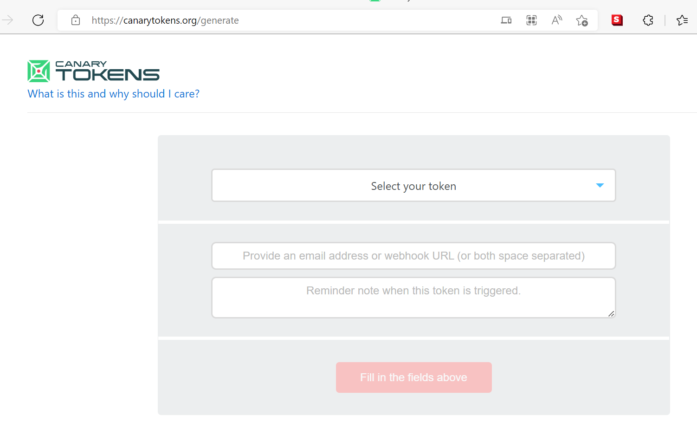

Under "select your token", they should select "Custom image web bug" and provide their own email address in the second field. They can give their token a name in the third field: it's a good idea for the name to be descriptive, for example "canary tokens exercise web bug June 30". The custom image web bug also asks the participants to upload an image. They should pick a random image that they do not mind sitting on the servers of the company that runs Canary Tokens--a random image from Google Search should do 🙂

Once the participants have filled out the fields, they should have the option to generate a token. When clicking on the generate button, they will get to a screen that looks like this:

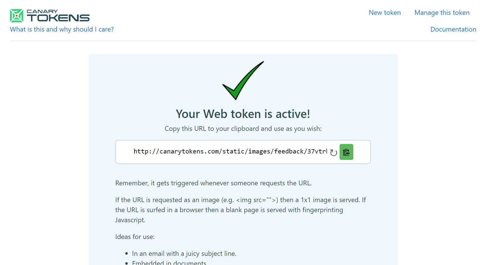

Participants need to copy the web address from the field and keep it in a safe place, like a notepad. We will need it in a moment.

The token itself consists of a link to the image which you just added. When a user tries to insert it into a document, their word processor will try to download this image from the canary tokens server. Since each one of those images has a unique link, the canary tokens server will know exactly what image has been downloaded at which time---and to whose token which image is linked.

In a moment, every participant will be asked to take the unique image that each of them had just created and copy it into two documents:

1.  A Word document on Microsoft Office on their computer (not the web version)

2.  A Google Docs document

The facilitator will ask what participants expect to happen when they copy the image into documents. Participants can make several guesses, with the correct answer being that the canary token will be triggered and will capture an IP address.

The facilitator might hint at this stage that the image will contact a server, which means that it will reveal an IP address used by the user. If any participants have a VPN installed, the facilitator can encourage them to enable it at this point. The facilitator can similarly ask what IP address would show up if participants have a VPN enabled, and allow participants to guess. (With the correct answer being that the token will either get the IP address of the user's local network or that of their VPN).

First, participants should paste the image into a Word document. To do so, they need to go to the "Insert" tab, and click on the button next to the "text box" button that says "Field":\
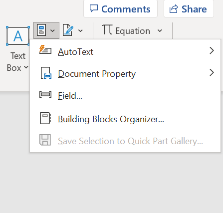
Participants should scroll through the "field names" list until they find one called "IncludePicture". Under "field properties", they should paste the address of the canary token under "Filename or URL" and click "OK":

Participants might see a security warning like the one below. If they do see it, then the facilitator can ask them what they think it means, why they see a warning, and what might be happening at this moment. The correct answer is that Microsoft Word is going to talk to an external webpage or server, and is asking participants to confirm that they definitely want to do this. For the purposes of this exercise, participants will be asked to click 'yes' on this notice. The facilitator might take an extra moment to explain that this action will trigger the token and that, if this were an unknown document, we would not want to press 'yes'. They can even expand on this statement by telling participants how most (though not all malware) requires active user engagement, for example by getting them to click on a prompt.

The image the participants uploaded will then appear in the document.

Participants will then be asked to open their email, where they should have received a message that looks like the one below:

\
\
When they click on "More info on this token", they will get to a second page that shows the location at which the token was triggered. Participants can then talk about what the token just discovered about them and how. If any participants have had a VPN enabled, they should see a different IP address. The facilitator could also discuss with participants what has happened in that case. The discussion should focus on how, every time we connect to a network, we reveal our IP address. In some cases, our IP address might be sensitive info. It could, for example, tell an adversary about where we currently are or where we work. The facilitator could even discuss [this tweet](https://web.archive.org/web/20210616183054/https://twitter.com/runasand/status/831266832678010880) with participants, which demonstrates why investigative journalists might not want to reveal their IP address to a website they visit, as it can allow the website to trace the visit back to their offices or newsroom. If participants ask how to mitigate this, the facilitator could suggest using a reputable VPN while also proposing another method (Google Drive or an alternate cloud) of opening suspicious documents, outlined below.

Participants will then be asked to open a blank document in Google Docs. They should then go to the insert menu and insert an image via URL, as shown below:\
\
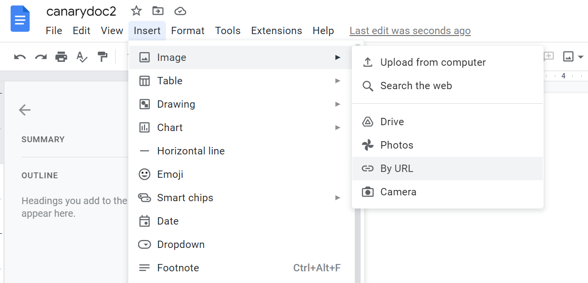

In the URL field, they should copy the same canary token tracker address which they inserted into Word:\
\
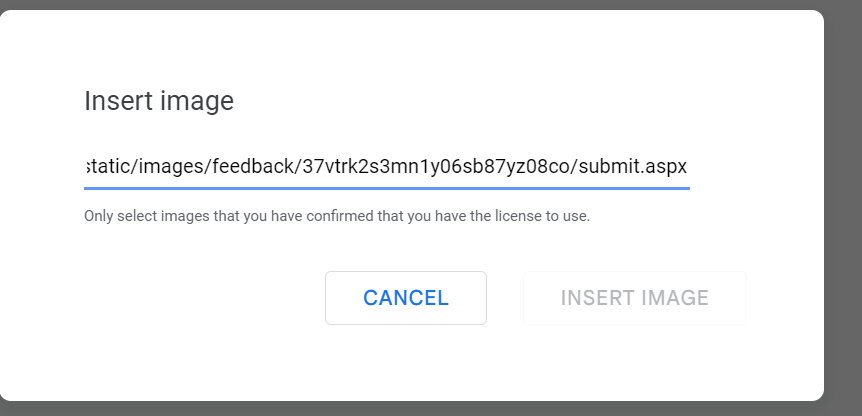

After inserting the image, the facilitator should ask participants on which IP address they expect to receive a notification. Following this, participants should open up their email inboxes again, where they should receive another email from the Canary Tokens Mailer, alerting them that their token has been triggered once again. If they follow the link to see more info on the Canary Token, they should see something like this:

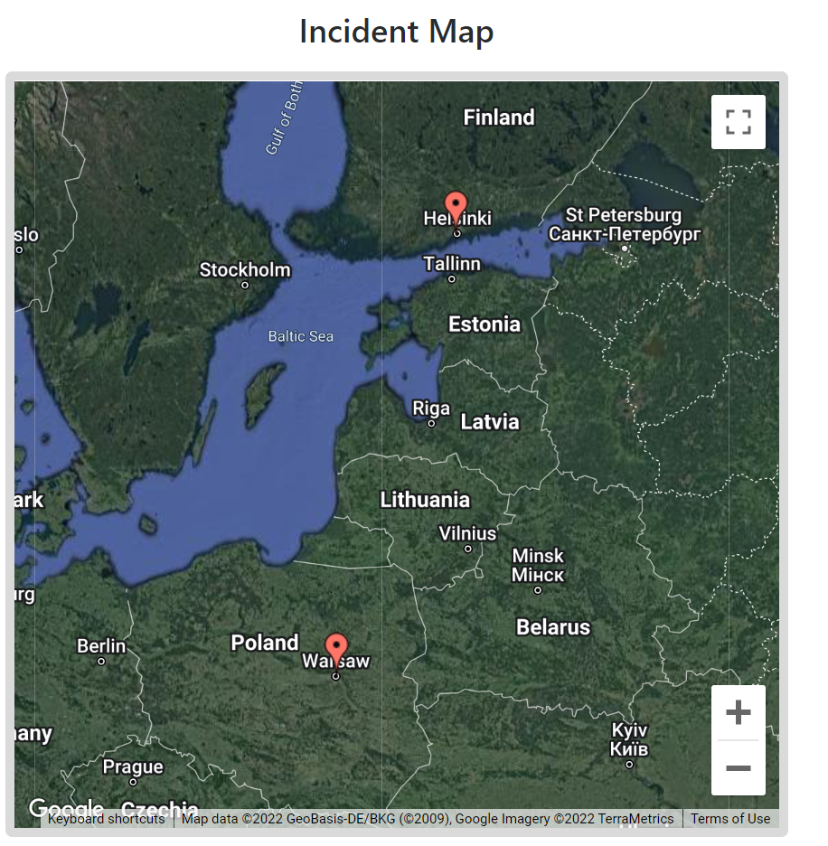

The token should have opened up in at least two IP addresses: one of them matching the IP address of the participant or the VPN they used, and the other being that of a Google server. On the right, there is a panel that allows participants to view more details about particular IP addresses which triggered the token. At least one of the addresses should be marked as belonging to Google:\
\
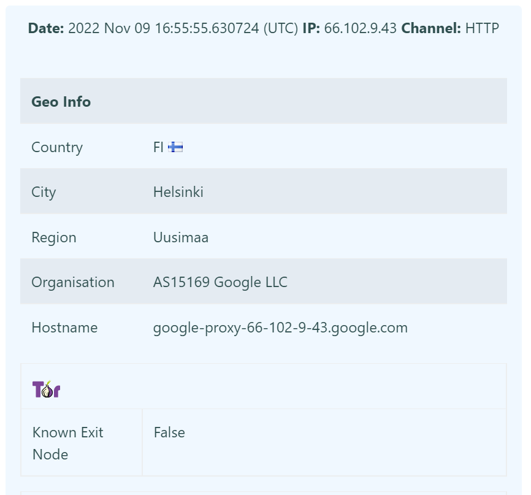

Following this, the facilitator leads a bigger conversation on what just happened and what we just witnessed. The token opened on a Google IP address, which implies that it was processed on a Google platform. This means that the token, and by extension attackers who might try to track you, do not know your real IP address but only know that you opened your documents on Google. Some main points that the facilitator should stress is that it is often safer to open files in a cloud platform like Google's rather than on your device, as all of the document and any trackers and malware it contains will run on Google's servers rather than your own device. This is often safer than using a VPN and opening files on your own device, which can keep you safe from trackers but not necessarily malware. At the same time, the facilitator could encourage participants to think of cases and threat models in which loading a document within Google or another cloud service is not advisable.

A word document token

Participants will be asked to once again access [https://canarytokens.org/generate](https://canarytokens.org/generate) and this time download a Microsoft Word token:\
\
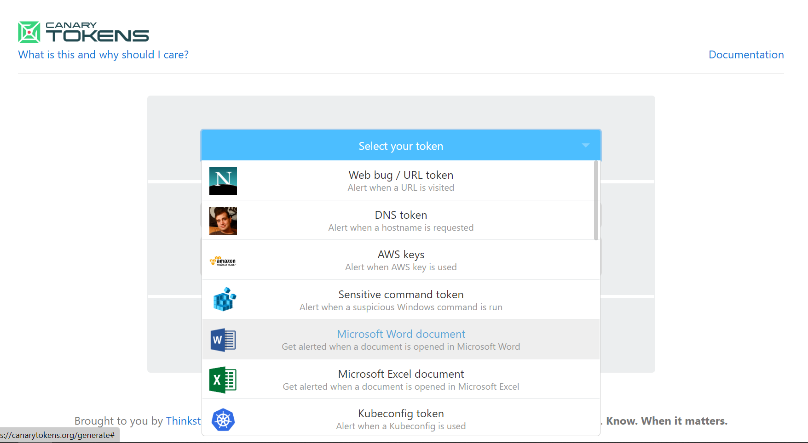
They should see the following page, which allows them to download the document:\
\
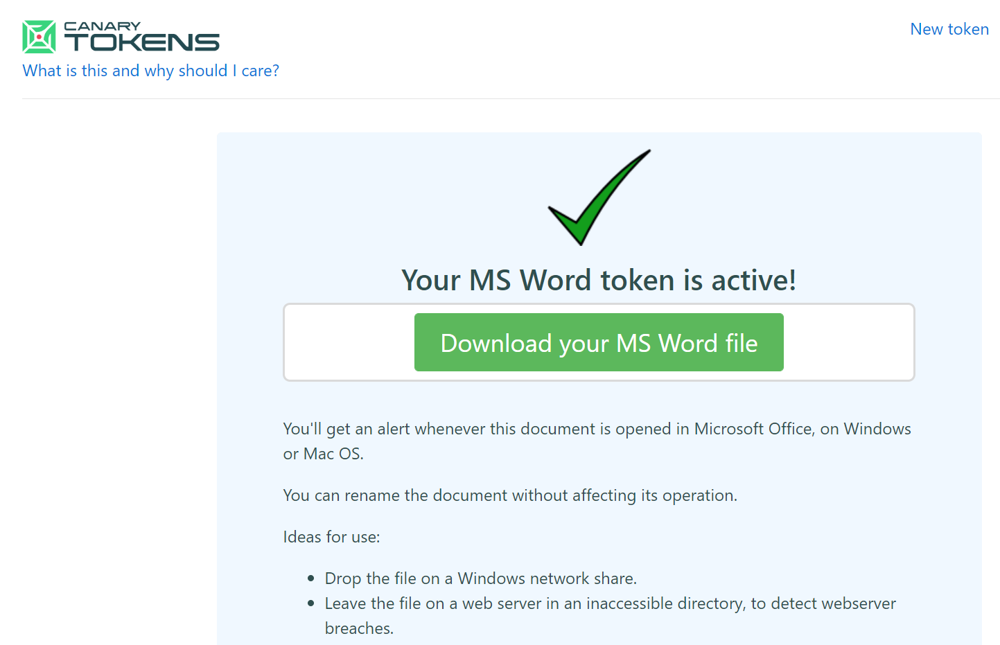{width="6.267716535433071in" height="4.041666666666667in"}

Participants should then download and open the file. It should be a blank Microsoft Word document and should open with the following warning:

The facilitator and the audience should talk for a moment about what Microsoft Word's Protected View might mean and what it does. They can do so by looking through Microsoft Word's settings and options while the document is open in Protected View and seeing which features are grayed out. Is it possible to print the document or do other things to it? The facilitator can explain that Protected View is a special mode in Word which works for documents which have been downloaded from the web or from emails. It restricts a lot of features for the Word window that has opened this specific document and therefore reduces the attack surface for documents which contain trackers or other potentially malicious features. The facilitator should emphasize to participants that this simulation, and canary tokens, are a safe environment where it is okay to make mistakes. As such, they should not be scared of accidentally triggering the tokens.

Just as a test, participants should enable editing on the document. The facilitator should then ask them if they think this triggered the canary token and, if so, from what IP address. Following this brief conversation, participants can check their email to see if they received a new message from the Canary Tokens mailer and, if they did, what IP address had contacted the token this time.

Participants might try to open the document in other document processors, such as Google Docs, Apple Pages, or LibreOffice, and see if doing so also triggers the token. The facilitator can encourage such experimentation but should emphasize that the Word token in particular triggers specific features within Microsoft Word itself and might therefore not work in other programs. The same might happen with some document-based malware, which might infect a computer through faults in one document based program but not another.

Securely forwarding a document with canary trackers to your newsroom

Following the same instructions as above, go to the canarytokens.org/generate webpage and generate a new Word document token. This time, you will need to press "enable editing" on the token to add text to it. The token will be triggered at least once. Note down the time at which this happened. Participants should receive an email notification with a timestamp to mark each triggering of the token.

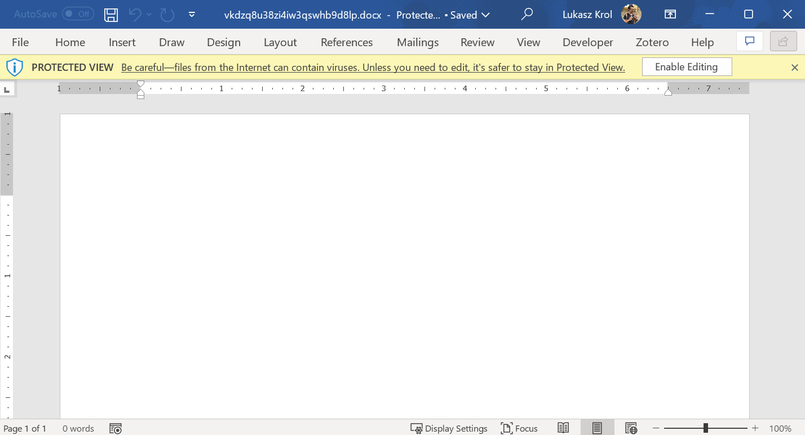

Once participants have opened the document, they should add some text and perhaps an image to it. They should then save it in a local folder on their devices, for example their Desktop or Download folders.

The goal of this exercise is to extract the text from the document without triggering the canary token again. You can look at the timestamp of your emails to see the time at which the token was triggered. We are purposefully not defining "extracting" the text in a lot of depth; participants should come up with a way that works for them.

Unfortunately, since the document has been opened in Microsoft Word's edit mode, it will no longer open in Protected View. To force Word to open it in Protected View again (and therefore simulate an actual suspicious document downloaded from an email or a webpage), it is necessary to upload the document somewhere like Google Drive and download it again.

As such, participants will be asked to take the document and upload it to Google Drive. The filename should still be a confusing string of letters and numbers, and participants should rename the file to something more descriptive. They can do so by right clicking on the file within Google Drive:

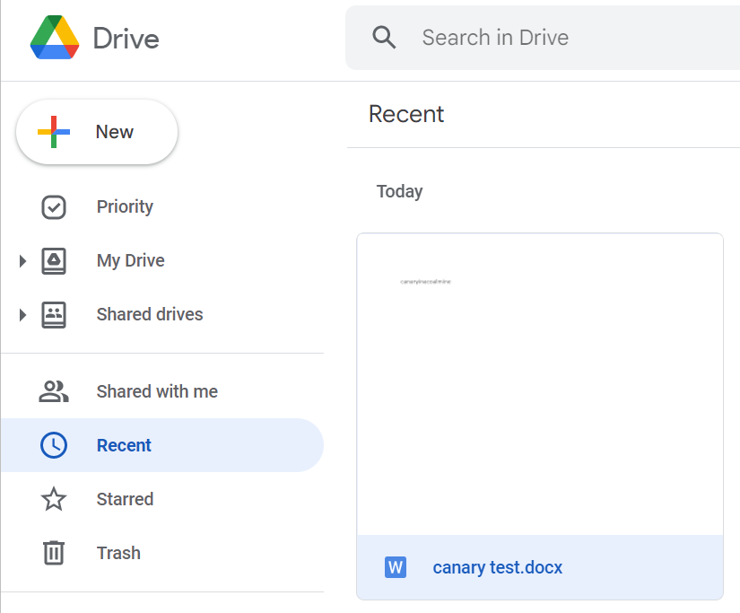

After the file has been renamed, participants can download it by, once again, right clicking on it within Google Drive:

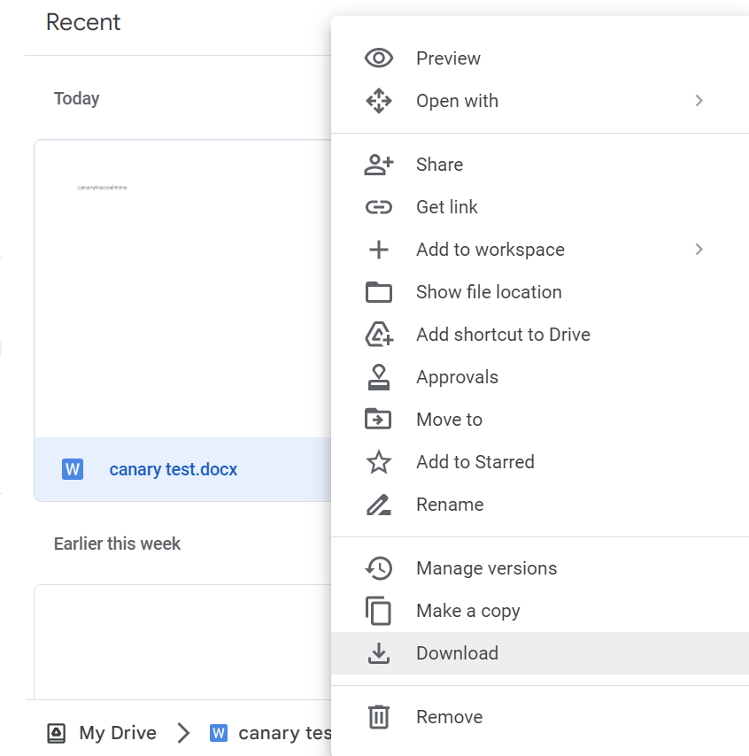

When participants try to open the file after it has been downloaded, they will notice that it is in Protected View once again. The facilitator may ask participants what would happen if they exited Protected View and enabled editing (with the correct answer being that the canary token would be triggered again).\
\
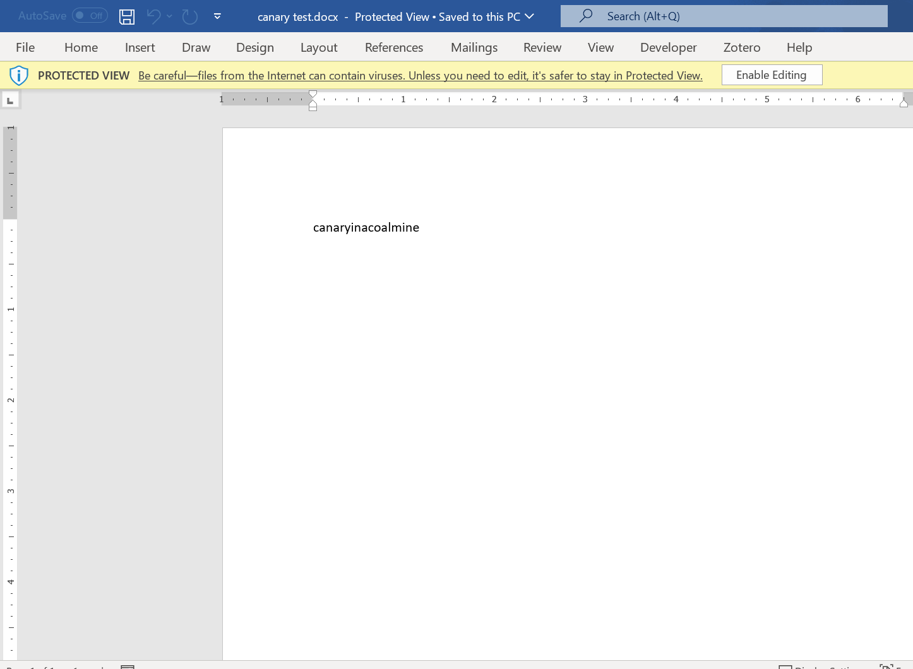

The final exercise is for participants to extract the content of a document without leaving Protected View. The facilitator should allow the participants to have as wide a definition of "extracting" the text as possible. Participants could do one of the following:

-   Open the document in a more locked down operating system, like in iOS, or in a cloud system, such as Google Drive

-   Get around Word's Protected View by selecting the text, copying, and pasting it into another document

-   Take a screenshot of the text while the document is open in Word's Protected View

-   Use a tool such as Dangerzone[^4] (if participants have it installed)

After any attempt to extract the text, participants may open their email to see if the token has been triggered.

### Continued alerts

In our testing, we have noticed that some of the canary tokens we set up would trigger email alerts months after the exercise. There might be lots of different reasons for this: perhaps the file was scanned by an antivirus program, an operating system's search feature, or a cloud service's index. This seems like normal behavior, so if you see any unexpected alerts, do not assume that any intrusion into your systems has occurred unless you have further evidence to suggest this (for example, the tokens were opened by completely unfamiliar or suspicious IP addresses such as VPN you do not recognize).

Each canary token has a settings page (you can go to "manage this token" in the email notification you receive) where you can turn off subsequent email notifications. We recommend both turning off the notifications and deleting all files with tokens after the exercise, both as a data hygiene move and to reduce false alerts.

## Conclusion

To conclude the simulation, the facilitator could lead a conversation on what this exercise meant and attempted to teach. Adversaries and state actors have been using both malware and trackers embedded in documents to attack or track journalists. The reason we are using canary tokens is because they are, to a certain degree, an analogy for malware, even if an imperfect one: if you can trigger a canary token, you can likely trigger malware or other trackers.

By way of conclusion, the facilitator could tell participants that we looked at how to open potentially dangerous documents and how it's best to do so either in a very locked down mode, such as Word's Protected Mode, or a cloud, such as Google Drive. The facilitator could ask participants about the pros and cons of both. It can be hard to copy or extract text out of Protected Mode, but not all threat models align well with cloud tools, either.

[^1]: When you open a file on a cloud-based platform, the service doesn't actually show you a copy of the file: instead, it opens the file and turns it into a webpage which you can read and often edit. This is an important but subtle difference; it means that any malware present in the file would try to execute on the cloud service---and be stopped by its security mechanisms---rather than on your device.

[^2]: Sending journalists samples of real malware or malicious trackers is a very bad idea. Even well studied or custom designed malware could lead to unintentional data exfiltration and should never be run on a system that has not been explicitly designed and air-gapped to run it. Successive software updates and anti-virus definitions will also cause slightly older malware samples to fail on systems that have been effectively secured.

[^3]: We have been on a call with the Thinkst team, where they mentioned that they have no plans to phase out the free version of canary tokens. At the same time, there is a free self-hosted version that is open source: https://github.com/thinkst/canarytokens

[^4]: Early drafts of this guide included special references to Dangerzone, a tool used to open potentially suspicious files. The tool is powerful but can be difficult to install and its features are changing rapidly at this moment. It should be much more stable in several months to a year. For this reason, this version of the facilitation guide did not talk about Dangerzone in any depth. If this facilitation happens at a later point, when Dangerzone has become more ubiquitous and user-friendly, then it can be included as one of the main tools.
